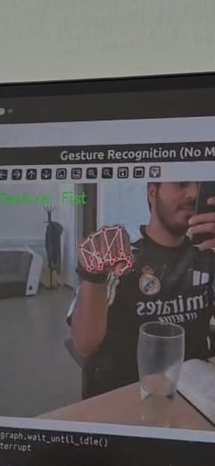

# Hand Gesture Recognition using OpenCV and MediaPipe

This project uses [MediaPipe](https://google.github.io/mediapipe/) and [OpenCV](https://opencv.org/) to recognize hand gestures from a webcam feed in real time — no machine learning training required!

## 📸 Demo



## 🖐️ Recognized Gestures

- Fist
- Open Palm
- Thumbs Up
- Peace Sign ✌️
- OK Sign 👌
- Call Me 🤙

## 🛠️ Requirements

- Python 3.7+
- OpenCV
- MediaPipe
- NumPy

Install the required packages using:

```bash
pip install -r requirements.txt
```
📂 Dataset: HaGRID
We evaluated the rule-based hand gesture recognition method using the HaGRID (HAnd Gesture Recognition Image Dataset). This dataset consists of millions of hand gesture images captured in the wild under various lighting, backgrounds, and hand orientations. It provides a more realistic benchmark for testing gesture recognition models compared to webcam input alone.

The evaluation script and results are included in the notebook:
📄 rule_based_methods.ipynb

📉 Conclusion
The rule-based method performs well in controlled environments such as live webcam feeds, where lighting is stable and gestures are clearly posed. However, when applied to the HaGRID dataset, the method fails to generalize due to:

Variability in hand sizes and orientations

Background clutter

Lighting inconsistencies

Occlusions and motion blur

This experiment demonstrates the limitations of rule-based approaches for real-world gesture recognition. For more robust and scalable solutions, machine learning or deep learning-based models are recommended.

